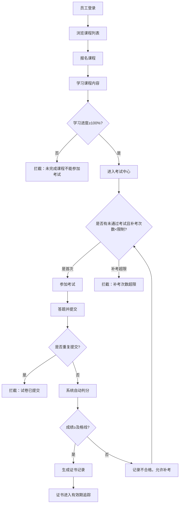
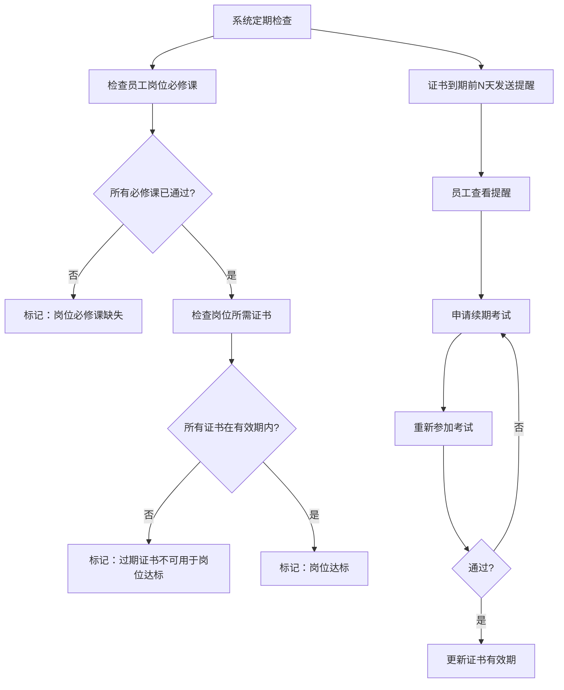

## 1. 产品概述

员工培训考试与证书到期提醒系统，用于企业人事部门管理员工培训课程、在线考试、岗位资质认证和证书有效期跟踪。系统支持从课程报名、学习进度跟踪、在线考试、自动判分、补考管理、证书发放到到期提醒的完整闭环，确保员工岗位资质合规。

- **目标用户**：企业人事管理员（HR）、企业员工
- **核心价值**：自动化培训考试流程、证书到期预警、岗位合规监控、数据可追溯

## 2. 核心功能

### 2.1 用户角色

| 角色 | 说明 | 核心权限 |
|------|------|----------|
| 人事管理员 | HR/培训管理员 | 创建/编辑课程、题库、岗位要求；管理证书有效期；查看所有员工数据；导出报表 |
| 员工 | 普通员工用户 | 报名课程、学习课程、参加考试、查看证书、查看个人达标状态 |

### 2.2 功能模块

1. **登录与身份切换**：角色选择登录，支持人事/员工视角切换
2. **人事管理面板**：课程管理、题库管理、岗位管理、证书配置、员工达标看板
3. **员工学习中心**：课程报名、学习进度、课程列表
4. **考试中心**：开始考试、试卷答题、自动判分、成绩查看、补考
5. **证书管理**：证书列表、证书状态、到期提醒、证书续期
6. **数据看板与导出**：员工达标看板、考试明细、证书状态、导出CSV

### 2.3 页面详情

| 页面名称 | 模块名称 | 功能描述 |
|----------|----------|----------|
| 登录页 | 角色选择 | 选择人事/员工身份，模拟登录 |
| 人事仪表盘 | 数据总览 | 员工达标率、即将到期证书数、考试通过率统计、课程完成率 |
| 人事-课程管理 | CRUD操作 | 创建/编辑/删除课程，设置课程内容、学分、关联岗位 |
| 人事-题库管理 | 版本化题库 | 创建/编辑题目，支持单选/多选/判断，题库版本号管理 |
| 人事-岗位管理 | 岗位配置 | 创建岗位，设置必修课程、证书要求、补考次数限制 |
| 人事-证书配置 | 有效期设置 | 配置各证书有效期、提前提醒天数 |
| 人事-员工达标看板 | 合规监控 | 按员工/岗位维度展示达标状态，红色高亮异常项 |
| 人事-考试明细 | 成绩查询 | 按员工/课程维度查看所有考试记录、成绩、补考次数 |
| 员工-学习中心 | 课程学习 | 查看可报名课程、已报名课程、学习进度条 |
| 员工-考试中心 | 在线考试 | 参加考试、答题、提交、自动判分、查看成绩 |
| 员工-我的证书 | 证书展示 | 查看所有证书、状态（有效/即将到期/已过期）、续期入口 |
| 员工-个人看板 | 个人状态 | 个人达标情况、待办事项、即将到期提醒 |
| 数据导出 | 报表导出 | 导出岗位、课程、成绩、证书有效期、提醒记录为CSV |

## 3. 核心业务流程

### 3.1 员工培训考试主流程

### 3.2 岗位达标与证书到期流程

### 3.3 数据流转说明

1. **题库版本变更**：修改题目时自动递增版本号，旧版本与已考试卷关联保留
2. **补考成绩覆盖**：补考通过后覆盖原不合格成绩，证书取最新通过记录
3. **证书续期**：续期考试通过后延长证书有效期，历史记录保留
4. **数据持久化**：所有学习进度、成绩、证书状态、导出历史存储于本地JSON文件，重启可查

## 4. 用户界面设计

### 4.1 设计风格

- **主色调**：深蓝（#1e3a5f）专业企业风，搭配青蓝（#0ea5e9）强调色
- **辅助色**：成功绿（#10b981）、警告橙（#f59e0b）、危险红（#ef4444）
- **中性色**：灰白层次（#f8fafc、#e2e8f0、#94a3b8、#334155）
- **按钮风格**：圆角4px，带微妙阴影，hover微上浮
- **字体**：Noto Sans SC（中文）+ JetBrains Mono（数据/代码）
- **布局风格**：左侧导航栏 + 顶部面包屑 + 卡片式内容区
- **图标**：Lucide React 线性图标

### 4.2 页面设计概览

| 页面名称 | 模块名称 | UI元素 |
|----------|----------|--------|
| 登录页 | 角色卡片 | 双角色大卡片，悬停发光动效，渐变背景 |
| 仪表盘 | 数据统计卡片 | 4列KPI卡片，带趋势数字和状态色块 |
| 管理列表页 | 数据表 | 带筛选、搜索、分页的表格，操作列含编辑/删除 |
| 考试页 | 答题界面 | 题目卡片、选项单选/多选、进度指示、倒计时 |
| 证书页 | 状态展示 | 证书卡片按状态色区分，倒计时徽章 |
| 看板页 | 合规矩阵 | 员工×课程/证书矩阵热力图，红黄绿三色状态 |

### 4.3 响应式

桌面端优先设计（≥1280px），侧边栏固定宽度240px；平板端（≥768px）侧边栏可折叠；移动端（<768px）改为底部Tab导航。
