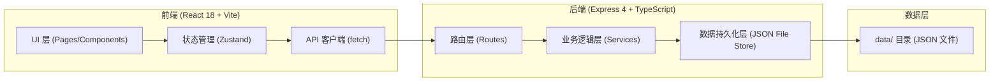
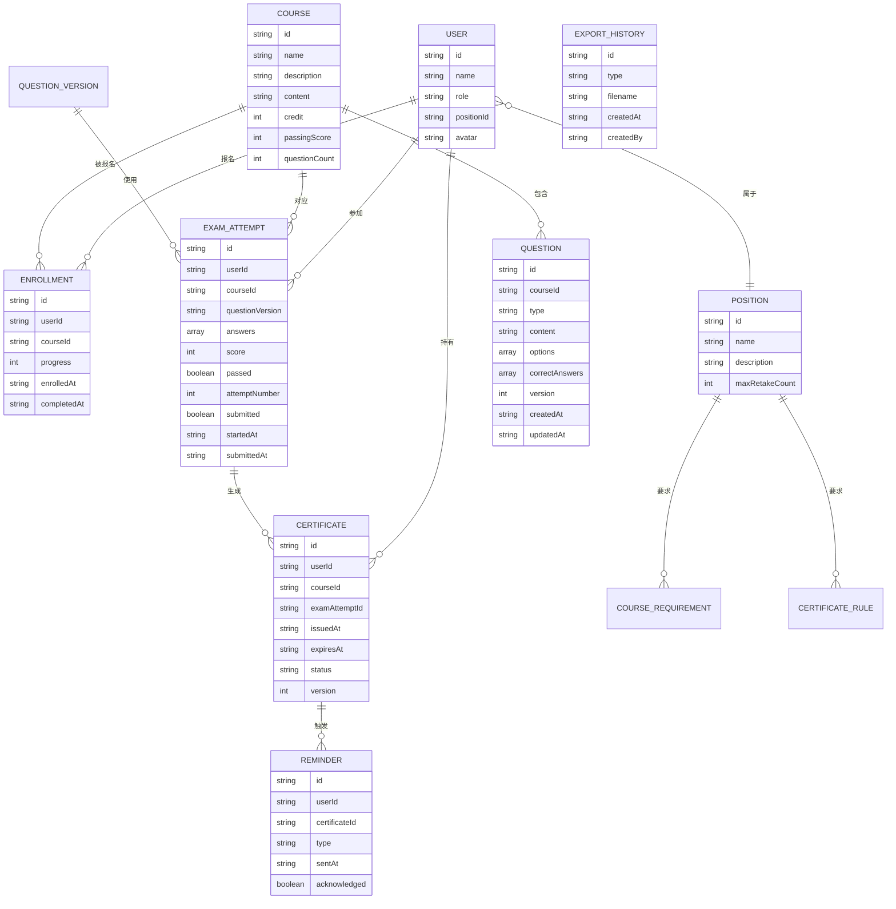

## 1. 架构设计

## 2. 技术描述

- **前端**：React 18 + TypeScript + Vite + TailwindCSS 3 + Zustand + React Router DOM + Lucide React
- **后端**：Express 4 + TypeScript + CORS
- **数据存储**：本地JSON文件持久化（`data/`目录），无需外部数据库
- **初始化工具**：vite-init (react-express-ts 模板)

## 3. 路由定义

### 前端路由

| 路由 | 页面 | 角色 |
|------|------|------|
| /login | 登录页（角色选择） | 公开 |
| /hr/dashboard | 人事仪表盘 | HR |
| /hr/courses | 课程管理 | HR |
| /hr/questions | 题库管理 | HR |
| /hr/positions | 岗位管理 | HR |
| /hr/cert-config | 证书配置 | HR |
| /hr/compliance | 员工达标看板 | HR |
| /hr/exam-records | 考试明细 | HR |
| /hr/export | 数据导出 | HR |
| /emp/dashboard | 员工个人看板 | 员工 |
| /emp/learning | 学习中心 | 员工 |
| /emp/exams | 考试中心 | 员工 |
| /emp/certificates | 我的证书 | 员工 |

### 后端 API 路由

| 方法 | 路径 | 用途 |
|------|------|------|
| GET | /api/users | 获取用户列表 |
| GET | /api/users/:id | 获取用户详情 |
| GET | /api/courses | 获取课程列表 |
| POST | /api/courses | 创建课程 |
| PUT | /api/courses/:id | 更新课程 |
| DELETE | /api/courses/:id | 删除课程 |
| GET | /api/questions | 获取题目列表 |
| POST | /api/questions | 创建题目 |
| PUT | /api/questions/:id | 更新题目（版本递增） |
| DELETE | /api/questions/:id | 删除题目 |
| GET | /api/positions | 获取岗位列表 |
| POST | /api/positions | 创建岗位 |
| PUT | /api/positions/:id | 更新岗位 |
| DELETE | /api/positions/:id | 删除岗位 |
| GET | /api/enrollments | 获取报名记录 |
| POST | /api/enrollments | 员工报名课程 |
| PUT | /api/enrollments/:id/progress | 更新学习进度 |
| GET | /api/exams | 获取考试记录 |
| POST | /api/exams/start | 开始考试（生成试卷） |
| POST | /api/exams/:id/submit | 提交试卷（自动判分） |
| GET | /api/certificates | 获取证书列表 |
| POST | /api/certificates/:id/renew | 证书续期申请 |
| GET | /api/reminders | 获取到期提醒列表 |
| GET | /api/compliance | 获取岗位达标数据 |
| GET | /api/export | 导出CSV数据 |
| GET | /api/export/history | 获取导出历史 |

## 4. 数据模型

### 4.1 ER 图

## 5. 核心业务规则（拦截逻辑）

1. **未完成课程拦截**：`enrollment.progress < 100` → 禁止创建考试
2. **重复提交拦截**：`examAttempt.submitted === true` → 禁止再次提交
3. **补考次数超限拦截**：同一用户同一课程 `attemptNumber >= position.maxRetakeCount + 1` → 禁止创建考试
4. **岗位必修课缺失**：岗位要求的所有必修课程中，任一未通过 → 岗位不达标
5. **过期证书拦截**：`certificate.expiresAt < today` → 该证书不计入岗位达标

## 6. 特殊验收逻辑

- **题库版本变更**：题目更新时 `version++`，每次考试记录使用的题库版本号存入 `examAttempt.questionVersion`
- **补考成绩覆盖**：同一用户同一课程，考试列表按时间倒序展示，证书取最新一次通过记录
- **证书续期**：续期通过后创建新证书记录（`version++`），旧证书保留为历史记录
- **数据持久化**：所有数据写入 `data/*.json`，服务启动时读取，写入时原子操作
